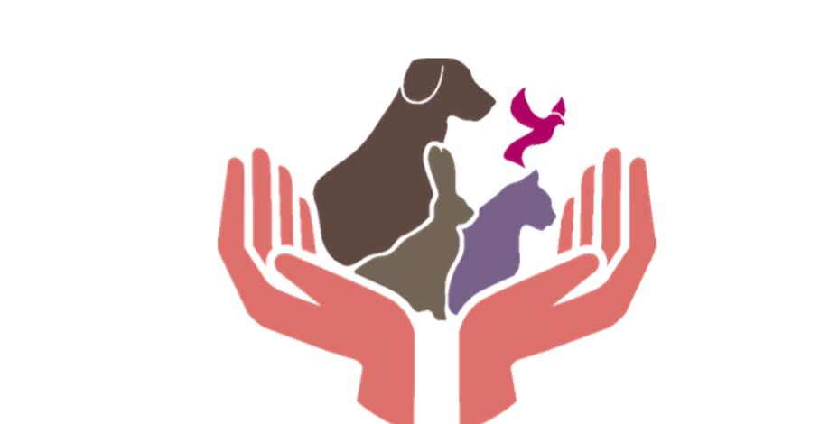

# 🌟 About EWAA - إيواء

**EWAA - إيواء :-**  
Is an android mobile application that provides a platform to increase awareness regarding pet adoption in Saudi Arabia by digitalizing and facilitating the adoption process, helping pet owners to find loving and suitable homes for their pets and matching pet adopters with and facilitating communication between pet owners and pet adopters to make the adoption process more efficient.
 

# 🖥️ Technology:

**Ewaa application will be programmed using:**  
1- Dart programming language and flutter framework. 
2- Firebase Database. 
3- Python for recommander system 

## 📱 launching instructions form visual studio code:

1- Open **2022-GP1-4** repository on GitHub  
2- Click on the code button  
3 -Download .zip file  
4- Unzip the file  
5- Open Visual Studio Code  
6- Click on File > Open > Location of the saved unzipped file then click on Ok  
7- Turn on an Android Emulator or connect an android mobile to the system  
8- Run the application  
 

## 📁 launching instructions from APK:

**Install the Ewaa APK files on your Android smartphone :**  
1- Open **2022-GP1-4** repository on GitHub  
2- start downloading APK from [https://github.com/HadeelQu/2022-GP1-4/blob/main/Apk/%3C4%3E_%3CEwaa%3E_Executable.apk.zip](https://github.com/HadeelQu/2022-GP1-4/blob/main/Apk/Group4_Ewaa_Executable.apk.zip)  
3- Unzip the file  
4- Open Downloads  
5- Tap on the APK file and tap **Yes** when prompted  
6- The app will begin installing on your device.    

